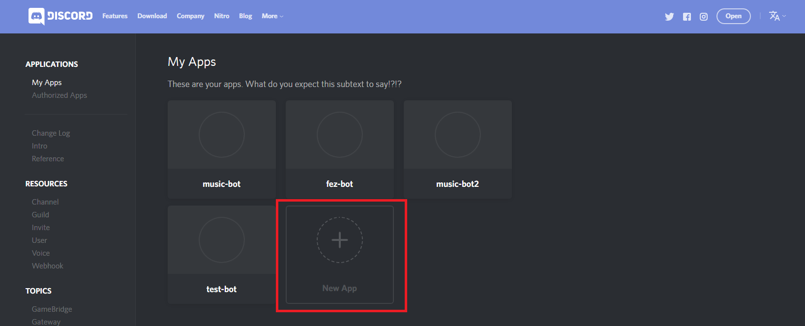
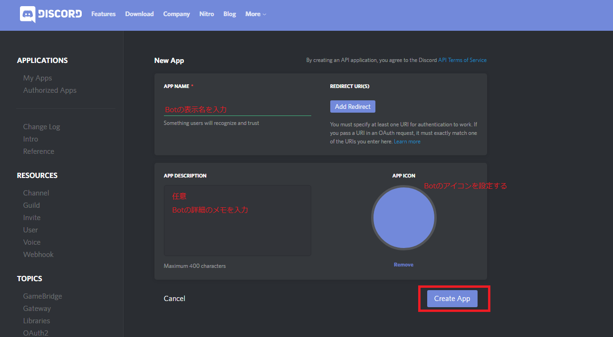
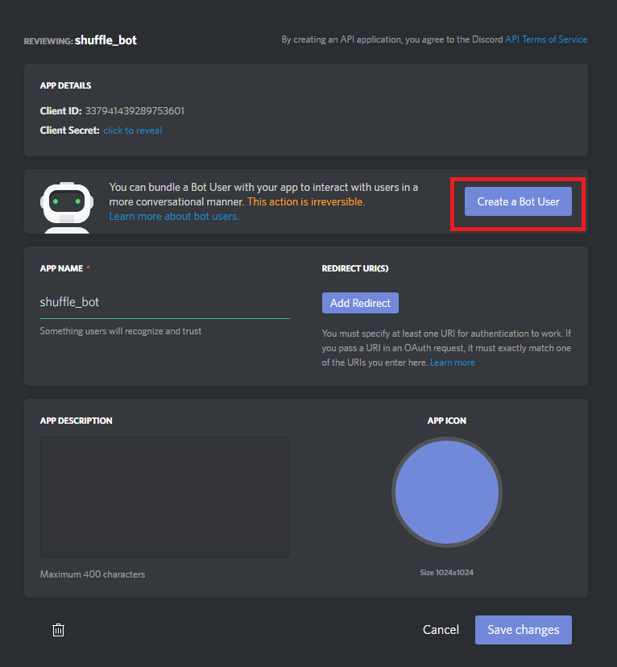
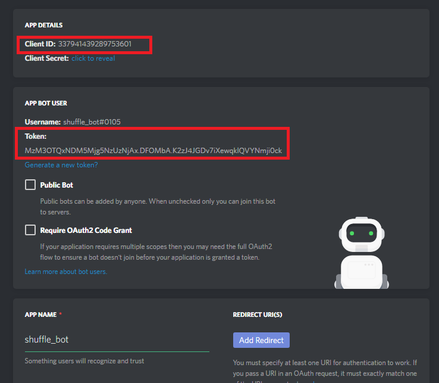
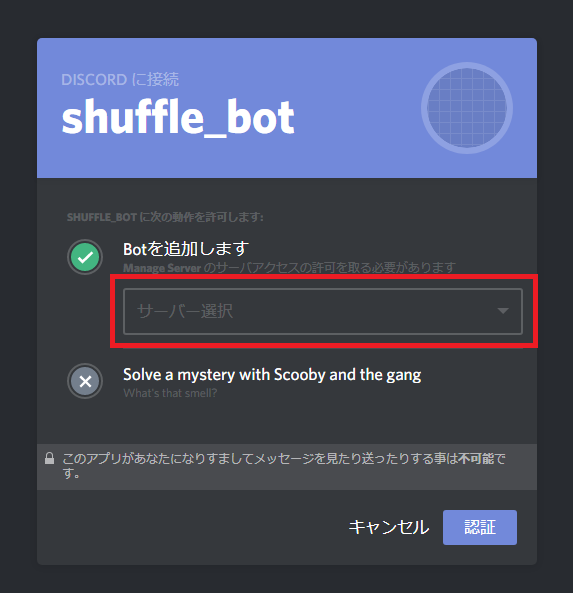

## 概要
トリガーワードを発言したユーザが参加しているボイスチャンネルのユーザを2チームに分けるDiscordのbot

## 使い方
### Discord bot userの作成
1. https://discordapp.com/developers/applications/me にアクセス
2. New App をクリックする
   
2. APP NAME に Botの表示名を入力する(grouping_botなど)  
   任意で、APP DISCRIPTIONや APP ICONを設定する
   
3. Create a Bot User をクリックし、Botを作成する
   
4. Tokenの"click to reveal"をクリックし、Tokenを表示させる
   
5. Client ID と Token をメモ帳等にメモしておく (後からでも見れます)
   
6. 下記URLの"<CLIENT ID>"を上記でメモしたClient IDに置き換えてアクセスする
   ```
   https://discordapp.com/oauth2/authorize?&client_id=<CLIENT ID>&scope=bot&permissions=0
   例の場合:
   https://discordapp.com/oauth2/authorize?&client_id=337941439289753601&scope=bot&permissions=0
   ```
7. サーバー選択で、botを追加したいサーバーを選択する。選択欄に表示されない場合は、サーバーにユーザを追加する権限が無いので、ユーザを追加する権限をサーバーの管理者にもらう必要がある。
   

### 設定ファイル
* config.yml を開き、 token に先程メモした Token を入力する。grouping_trigger は チャットからbotを動かす際のトリガーとなる文字列を入力する。必要がなければ変更する必要はない。
  ```
  token: MzM3XXXXXXXXXXXXX
  grouping_trigger: shuffle
  ```

### groupingの実行
* Linux の場合
```sh
go build grouping.go
./grouping
```

### チャットでの使い方

Discordで実行したいサーバに対象のbotを参加させ、任意のテキストチャンネルでトリガーに設定したワードを発言すると、チーム分けされたテキストが発言される。

例(user1が参加しているボイスチャンネルにuser2-4がいる場合):
```
[user1] shuffle
[bot] red_team: user1, user3
[bot] blue_team: user2, user4
```
